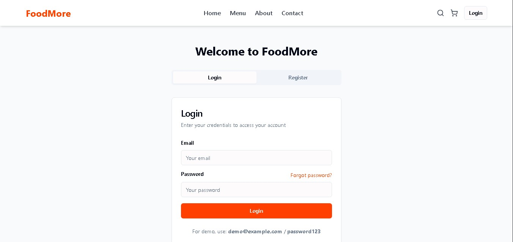
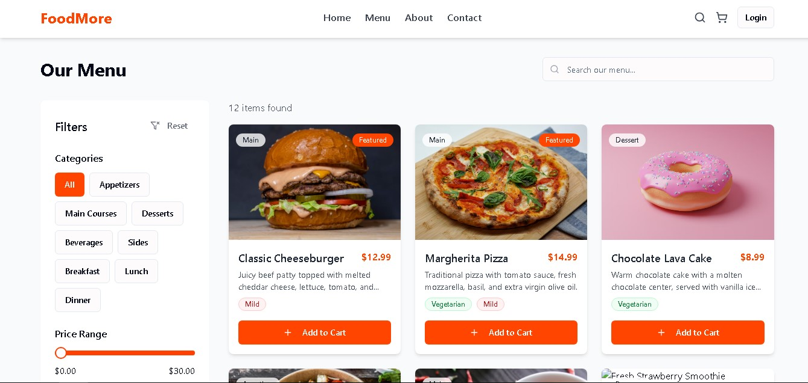
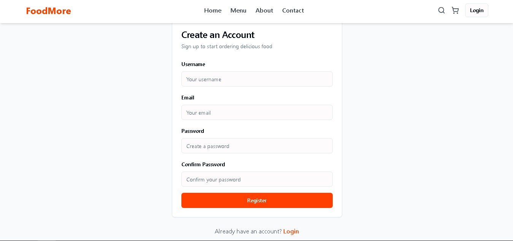
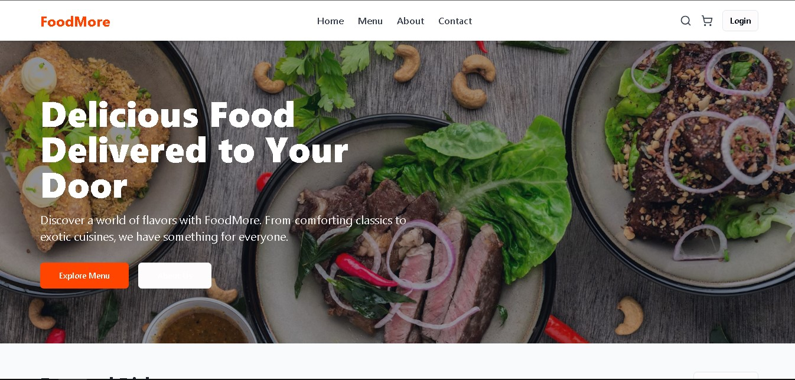

# Restaurant-Application

Restaurant-Application MERN stack Based.

## Used technologies:

    - React
    - Redux
    - React Router
    - Axios
    - Styled-components
    - Node.js
    - Express.js
    - MongoDB
    - Mongoose
    - npm
    - nginx

# Project View:

Some Screenshots of this project are given below
 

    
    
    
    

# Have a nice day

# Thank you for visiting my profile.
